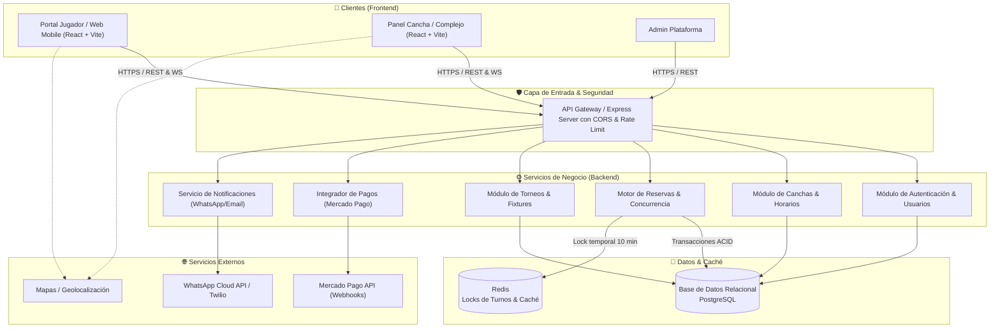
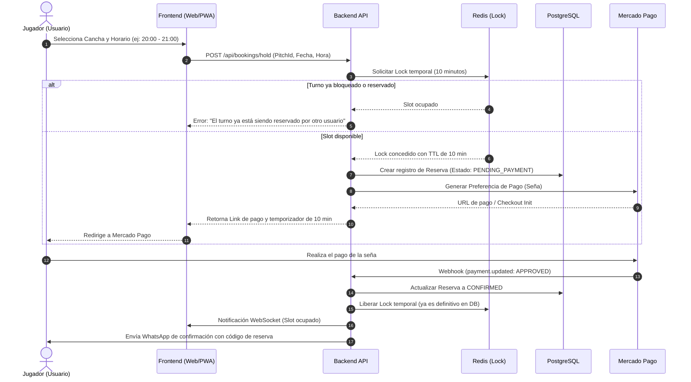

# 🏛️ Arquitectura del Sistema - Fut5Go

Este documento detalla la arquitectura técnica, las capas de la aplicación y los flujos críticos de información entre los clientes, la API y los servicios de terceros.

---

## 1. Visión General de la Arquitectura

---

## 2. Flujo Crítico: Reserva de Turno con Prevención de Solapamiento

El problema clásico en aplicaciones de canchas es que dos usuarios intenten reservar el mismo turno al mismo tiempo. El siguiente diagrama ilustra cómo se previene la doble reserva mediante bloqueo temporal:

---

## 3. Capas del Software

### Frontend (`apps/frontend`)
- **UI Components:** Basados en Tailwind CSS y componentes modulares accesibles.
- **State Management:** 
  - `Zustand` para el estado global del cliente (usuario autenticado, carrito/turno en proceso).
  - `TanStack Query` para caching del lado servidor, reintentos automáticos y sincronización de datos de canchas.
- **Client Services:** Abstracción en `src/services/` para cada dominio (`authService`, `bookingService`, `complexService`, `tournamentService`).

### Backend (`apps/backend`)
- **Controllers:** Manejo de la petición HTTP, validación de parámetros mediante esquemas (Zod) y envío de códigos de estado HTTP semánticos (200, 201, 400, 401, 404, 409).
- **Services (Lógica Pura):** No conocen los objetos `req` ni `res`. Reciben datos planos y orquestan la lógica de negocio, validaciones cruzadas y llamadas a la base de datos.
- **Middlewares:**
  - `authMiddleware`: Valida el token JWT y adjunta `req.user`.
  - `roleMiddleware`: Verifica que el usuario tenga el rol necesario (ej. `COMPLEX_ADMIN`).
  - `errorMiddleware`: Captura excepciones no controladas y formatea una respuesta limpia sin filtrar información sensible del servidor.

### Persistencia y Concurrencia
- **PostgreSQL:** Elección ideal por soporte de transacciones ACID estrictas (`SELECT ... FOR UPDATE` en caso de no contar con Redis) e integridad referencial sólida.
- **Redis (Opcional en fase inicial, recomendado en producción):** Manejo de locks distribuidos mediante `SET resource_name my_random_value NX PX 600000`.
