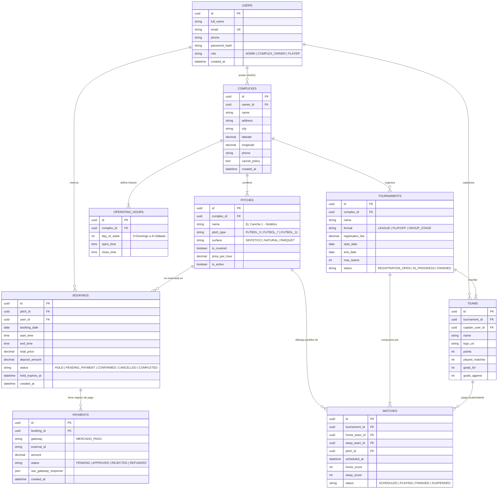

# 💾 Diseño del Modelo de Datos (Database Design) - Fut5Go

Este documento describe el esquema de base de datos relacional para el sistema **Fut5Go**, diseñado para soportar tanto la gestión de turnos/canchas como el módulo de torneos barriales.

---

## 1. Diagrama Entidad-Relación (ERD)



---

## 2. Índices y Restricciones Clave para Alto Rendimiento

Para asegurar consultas rápidas y prevenir turnos duplicados:

1. **Restricción Unitaria (Constraint) para Evitar Solapamientos:**
   ```sql
   -- Ejemplo conceptual: No puede haber 2 reservas confirmadas para la misma cancha, fecha y hora de inicio
   CREATE UNIQUE INDEX idx_unique_confirmed_booking 
   ON bookings (pitch_id, booking_date, start_time) 
   WHERE status IN ('CONFIRMED', 'HOLD');
   ```

2. **Índices de Búsqueda Geográfica y por Fecha:**
   - `INDEX idx_complexes_city_location (city, latitude, longitude);` (Búsqueda rápida de canchas en el mapa).
   - `INDEX idx_bookings_date_status (booking_date, status);` (Filtrado del calendario para saber qué slots están ocupados).

3. **Campos Soft-Delete (Opcional):**
   - Se recomienda agregar `deleted_at TIMESTAMP NULL` en complejos y canchas para no romper el historial de reservas de años anteriores si una cancha se da de baja.
